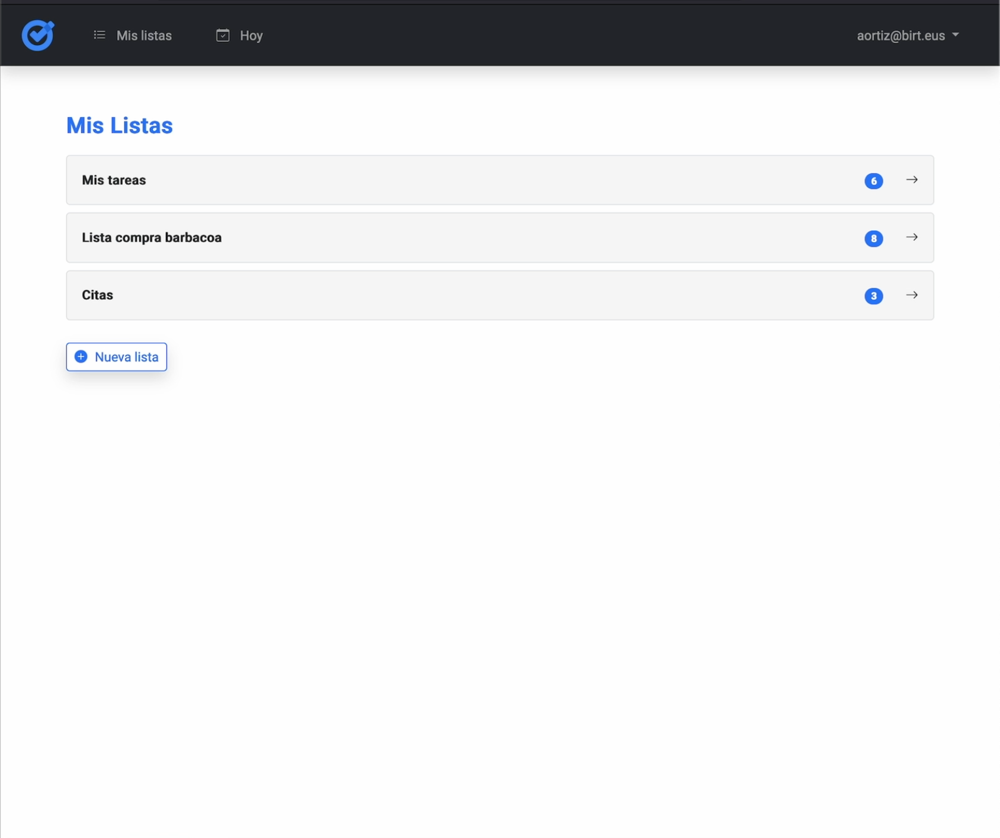
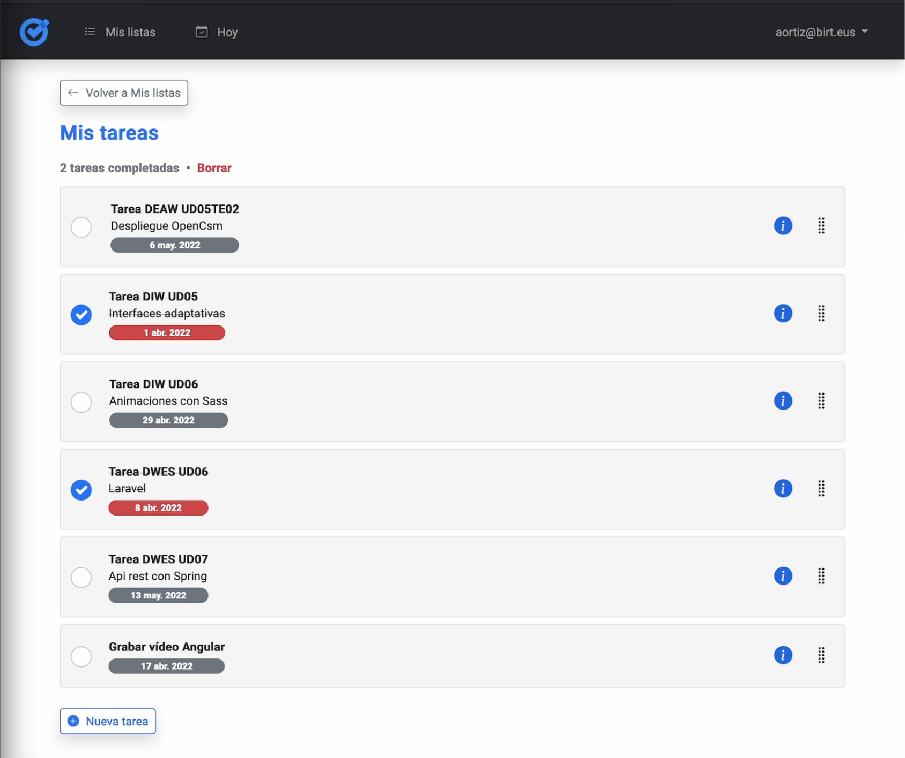
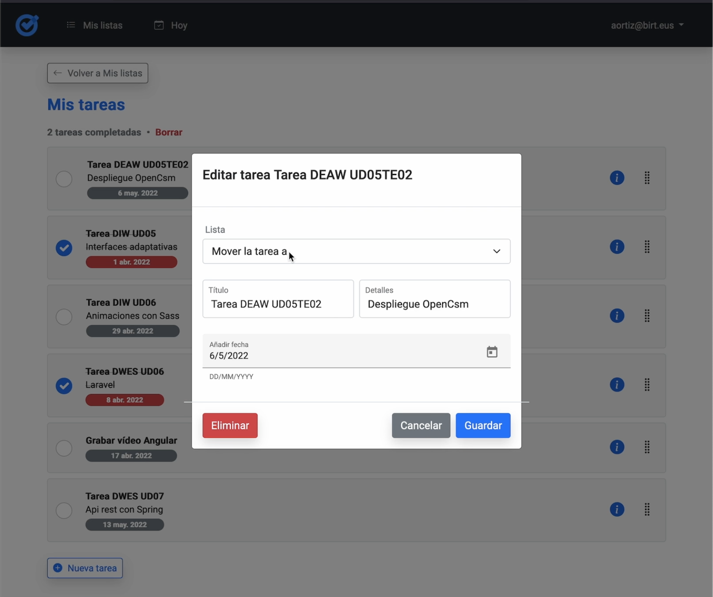

# Tasks App

Tasks App is an uncomplicated web application build with Angular and Material UI library that consumes [Google Tasks API](https://developers.google.com/tasks/reference/rest?hl=es-419) to store, edit, delete and view your own tasks.

## How to build
- Create a new project using the [Google Cloud Console](https://developers.google.com/workspace/guides/create-project?hl=es-419)
- Follow the instructions given in [this quickstart guide](https://developers.google.com/tasks/quickstart/js?hl=es-419) to get your own CLIENT_ID key
- Enter your key in the [environments.ts](src/environments/environment.ts) file
- Run `ng serve` for a dev server. Navigate to `http://localhost:4200/`

## Screenshots

  
